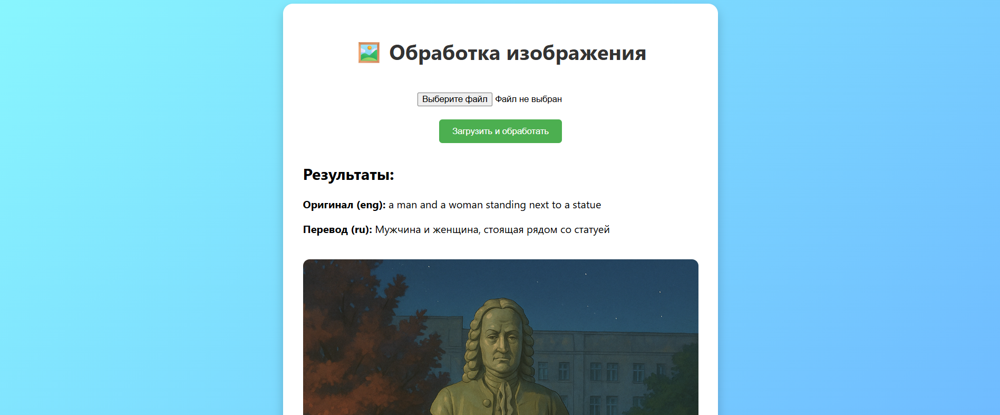

# analyze_img
Сайт для описания картинок и перевод с английского на русский
<h4> <a href = "https://colab.research.google.com/drive/1-yfbHVXyNJFTGpTZMCR2qUDwagYG7Yyj?usp=sharing"> Ссылка на рабочий код в виртуальном пространстве Google Colab </a></h4>

{# width=70% }

# 🖼️ Image Text & Caption Processor

Это веб-приложение на Flask, которое:

- Распознаёт текст на изображении с помощью Tesseract,
- Генерирует описание изображения, если текста нет (BLIP),
- Переводит результат на русский язык (Google Translate),
- Преобразует перевод в аудиофайл (gTTS),
- Отображает оригинальный и переведённый текст/описание,
- Позволяет прослушать сгенерированное аудио прямо в браузере.

---

## 🚀 Возможности

- ✅ Загрузка изображений (jpg, png и т.д.)
- ✅ Распознавание текста (OCR)
- ✅ Генерация описаний изображений (AI)
- ✅ Перевод на русский язык
- ✅ Генерация аудио с озвучкой на русском
- ✅ Веб-интерфейс с HTML5 и CSS

---

## 🧠 Используемые технологии

- Python 3.8+
- Flask
- OpenCV
- pytesseract
- gTTS
- Hugging Face Transformers (BLIP)
- Googletrans (переводчик)
- HTML5 + CSS3

---
## Установка для локального пользования через локальный сервер на Flask
---
## 🗂️ Структура проекта
project/
│
├── app.py                 # Flask-приложение

├── static/                # Статические файлы (CSS, изображения, аудио)

│   ├── styles.css

│   └── *.mp3 / *.jpg ...

├── static_wb/             # Папка для временных файлов

├── templates/

│   └── index.html         # Основной HTML-шаблон

├── requirements.txt       # Зависимости

└── README.md

└── Makefile


---

## 📦 Установка

### 1. Клонируйте репозиторий
```bash
git clone https://github.com/ваш_ник/image-caption-translator.git
cd image-caption-translator
```
### 2. Создайте виртуальное окружение (рекомендуется)
```bash
python -m venv venv
source venv/bin/activate  # или venv\Scripts\activate на Windows
```
### 3. Установите зависимости
```bash
pip install -r requirements.txt
```
### 4. ⚙️ Убедитесь, что установлены:
- <a href = "https://github.com/tesseract-ocr/tesseract">Tesseract OCR:</a>
- <a href = "https://ffmpeg.org/download.html">FFmpeg (для Pydub):  </a>
### 5. ▶️ Запуск
```bash
python app.py
```
#### Ссылыка <a href = "http://127.0.0.1:5000/">http://127.0.0.1:5000/
</a>

### 6.
🛠️ Заметки
Путь сохранения файлов сейчас прописан жёстко:
```python3
audio_path = 'C:/Users/DIMA/.../static/filename.mp3'
```
🔧 Рекомендуется заменить на относительные пути и использовать os.path.join.

## Makefile

- make install — установить зависимости из requirements.txt

- make run — запустить Flask-приложение

- make clean — удалить сгенерированные аудио и изображения

- make update-models — принудительно обновить модели BLIP

- make lint — проверить стиль кода с помощью black (если установлен)
  
## 📜 Лицензия

MIT License — свободно используйте и модифицируйте.


